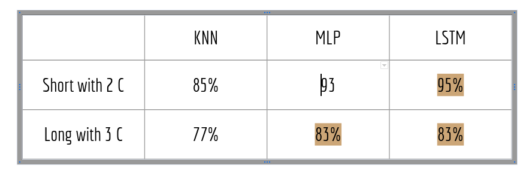

# Identity-recognition-from-audio

### The task:
Identity recognition from audio. This project is about classifying between two persons based on the sound of their voice. You are free to come up with a dataset yourself, or you can try my dataset, which is taken from the publicly available Danish podcast ‘Her Går Det Godt’ with the two hosts Peter Falktoft and Esben Bjerre. The dataset consists of 300 audio snippets of 5s split evenly between Peter, Esben and background. It may be that you want to split the data into even shorter segments, e.g. 1s. Remember to hold back some data for validation and/or test. You can either try to build your own classifier network that processes 1D waveforms, or you can try to solve it with few-shot learning, i.e. with an audio embedding model where you embed only a few training instances and then do classification using k-NN. See e.g. pyannote for inspiration: https://github.com/pyannote/pyannote-audio#tldr - the call to pipeline() can take an extra argument for returning speaker embeddings for each audio snippet, or you can even make pyannote segment the speakers throughout a full audio file (not included in dataset) and then get the embeddings out in the end for the task. Dataset: https://bit.ly/3QzmIiY.

### Solutions:

Knn, Multilayer perceptron and recurrent neural network have been proposed as a solution

### Results:

*For a full description of the approach see the project_description.pdf*